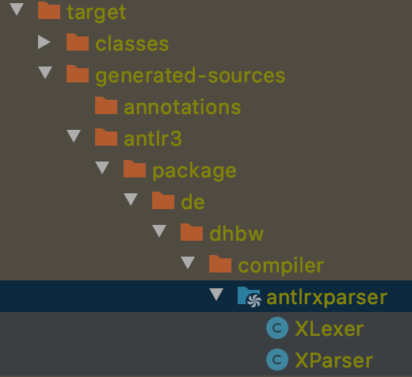

# ANTLR 3.5.2 - runnable with IntelliJ
This project offers an executable version of "CC-Praxis-Antlr Parser fuer X-Leer". 
Further tasks, solutions and packages have to be inserted with the course of the lecture itself.
Grammars are located in the folder "antlr3".
After generation via the plugin "antlr3"  the sources are located under 
*target/generated-sources/antlr3/package/de/dhbw/compiler*.

In case that your generated classes are not found by your IDE mark the folder *target/generated-sources/antlr3/package* as *generated sources root*.

